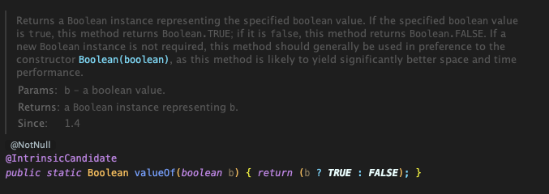
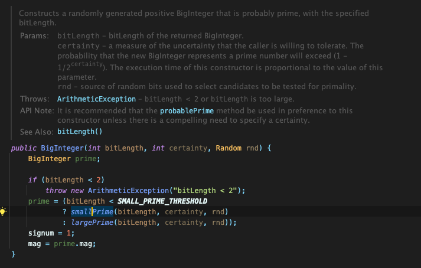
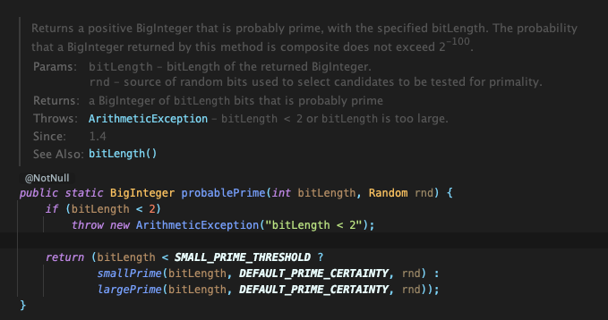
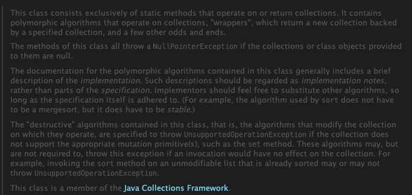
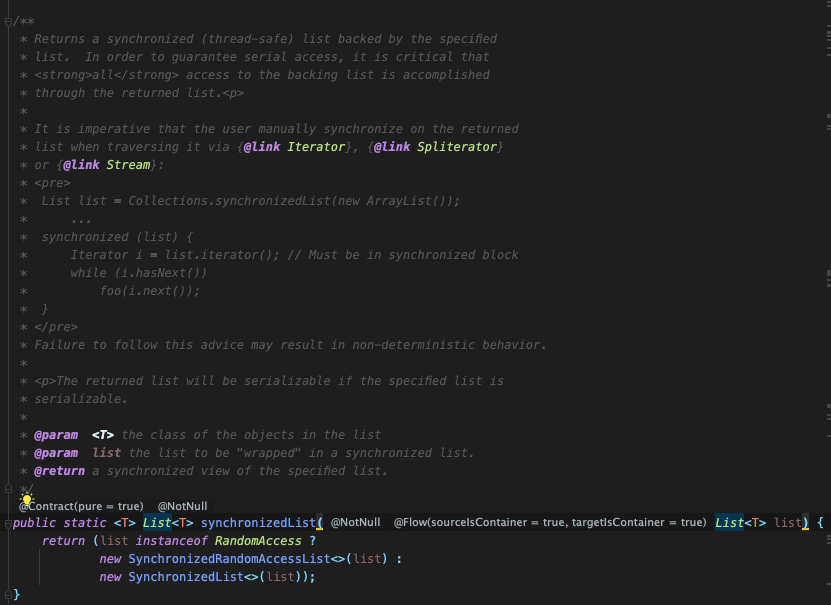
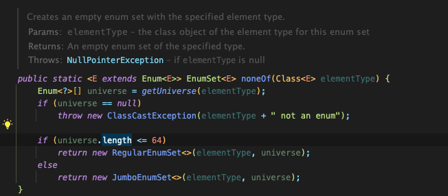

# 01. 생성자 대신 정적 팩토리 메서드를 고려하라

## **생성자 대신 정적 팩토리 메서드를 고려하라**

클라이언트가 클래스 인스턴스를 얻는 방법에는 전통적인 방법 중 하나는  public이다. 하지만 **정적 팩터리 메서드(static factory method)**도 꼭 알아두어야한다.

## 1\. 정적 팩터리 메서드란?

그렇다면 정적 팩터리 메서드는 무엇일까? 간단히 말해 객체 생성의 역할을 하는 클래스 메서드로, static 메서드를 통해 인스턴스를 생성하는 것이다. 다음은 java의 기본 Boolean 클래스 내 정적 팩토리 메서드의 간단한 예시이다. 
<p align="center"></p>

이팩티브 자바에서는 정적 팩토리 메서드를 사용할 시의 5가지 장점과 2가지 단점에 대해 서술하고 있어 자세한 비교를 통해 하나하나 알아보려 한다.

## 2\. 정적 팩토리 메서드 (static factory method)의 장점

#### 2-1. 이름을 가질 수 있다.

인스턴스를 대표하는 생성자가 명확하거나, 반환될 객체에 대한 설명이 필요하지 않을 경우에는 크게 느껴지지 않는 차이일 수 있지만, 이름을 가질 수 있어 반환될 객체의 특징을 설명할 수 있다는 것은 굉장한 장점이다. 이펙티브 자바에서는 BigInteger와 BigInteger.probablePrime의 차이를 예로 들고 있다. 먼저 BigInteger(int, int, Random)의 예제를 보면
<p align="center"></p>

설명을 읽어보면 "지정된 bitLength의 소수일 가능성이 있는 임의의 BigInteger를 생성한다."는 것을 이해할 수 있지만, 그전에는 명확한 반환될 객체의 특성을 알 수 없다. 또한, 하나의 시그니처로는 생성자를 한 개만 만들 수 있기에 제약이 있다. 예를 들어 동일한 BigInteger(int, int, Random) 생성자는 다른 의미를 가질 수 없다. BigInteger(int, Random, int)와 같이 순서를 바꾸거나, 추가하는 식으로 피해 갈 수는 있지만, 당연히 좋지 않은 방식이다. (추가될 때마다 클래스 설명 문서를 확인해야 하고, 호출하는데 실수가 있을 수 있다.)

그에 비해 자바 4에서 추가된 BigInteger.probablePrime을 보면 

<p align="center"></p>

"값이 소수인 BigInteger를 반환한다"라는 의미를 이름만으로도 충분히 유추가 가능하다. 따라서 한 클래스에 시그니처 생성자가 여러 개 필요하다면 생성자를 정적 팩토리 메서드로 바꾸고 그 특징을 설명할 수 있는 이름을 붙이자

#### 2-2. 호출될 때마다 인스턴스를 새로 생성하지 않아도 된다.

개인적으로는 큰 시스템일수록 가장 큰 장점이 되지 않을까 싶은데, 불변 클래스는 인스턴스를 미리 만들어 놓거나 새로 생성된 인스턴스를 캐싱하여 활용하기에 불필요한 객체 생성 방지한다. 위의 예제에서 본 Boolean.valueOf(boolean)을 보면 객체를 아얘 생성하지 않는다. 그래서 (특히 생성 비용이 큰) 같은 객체가 자주 요청되는 상황이라면 성능을 상당히 올려준다. 또한 이는 인스턴스의 생명 주기를 철저히 컨트롤 가능하는 뜻이며, 클래스를 싱글턴 혹은 인스턴스화 불가 상태로 만들 수도 있다.

#### 2-3. 반환 타입의 하위 타입 객체를 반환할 수 있다.

반환할 객체의 클래스를 자유롭게 선택할 수 있는 유연성을 제공한다. 응용하면 API를 만들 때 구현 클래스를 공개하지 않고 객체를 반환할 수 있어 API를 작게 유지가 가능하다. 자바 8 전에는 인터페이스에 정적 메서드 선언 불가하였고, 이름이 “Type”인 인터페이스를 반환하는 정적 메서드가 필요하면 “Types”라는 (인스턴스화 불가인) 동반 클래스를 만들어 그 안에 정의하는 것이 관례였다.

예를 들어 자바 컬렉션 프레임워크는 핵심 인터페이스들에 수정 불가나 동기화 등의 기능을 붙인 총 45개의 유틸리티 구현체를 제공하고, 이 구현체 대부분을 단 하나의 인스턴스화 불가 클래스인 java.util.Collections에서 정적 팩토리 메서드를 통해 얻도록 한다.

다음은 java.util.Collections의 동기화 기능의 정적 팩터리 메서드이다.

<p align="center"></p>
<p align="center"></p>

컬렉션 프레임워크 자체는 이 45개 클래스를 공개하지 않기 때문에 API 외견을 훨씬 작게 만들 수 있었다. API가 작아진 것은 물론 개념적인 무게, 프로그래머가 API를 사용하기 위해 익혀야 하는 개념의 수와 난이도도 낮아졌다.

(프로그래머는 명시한 인터페이스 대로 동작하는 객체를 얻을 것임을 알기에 굳이 문서를 찾거나 실제 구현클래스가 무엇인지 알아보지 않아도 된다. 나아가 정적 팩토리 메서드를 사용하는 클라이언트는 얻은 객체를 인터페이스만으로 다루게 된다.)

추가로, 자바 8부터는 인터페이스가 정적 메서드를 가질 수 없다는 제한이 풀렸기에 인스턴스화 불가 동반 클래스를 둘 이유가 별로 없다. 동반 클래스에 두었던 public 정적 멤버들 상당수를 그냥 인터페이스 자체에 두면 된다. (자바 9에서는 private 정적 메서드까지 허용하지만 정적 필드와 정적 멤버 클래스는 여전히 public이어야만 함)

#### 2-4. 입력 매개 변수에 따라 매번 다른 클래스의 객체를 반환할 수 있다.

반환 타입의 하위타입이기만 하면 어떤 클래스의 객체를 반환하던 상관없다. 심지어 다음 릴리즈에서는 또 다른 클래스의 객체를 반환해도 된다. 즉 하위 타입이기만 하면 API 변경 시 또 다른 클래스의 객체를 반환해도 된다. 예를들어 EnumSet 클래스는 public 생성자 없이 정적 팩토리만 제공하는데 openjdk에서는 원소의 수에 따라 두 가지 하위 클래스중 하나의 인스턴스를 반환한다.

<p align="center"></p>

반환 값을 보면 원소가 64개 이하면 long변수 하나로 원소를 관리하는 RegularEnumSet을, 65개 이상이면 long 배열로 관리하는 JumboEnumSet을 반환한다. 만약 원소가 적을 때 RegularEnumSet을 사용할 이점이 없어진다면 다음 릴리즈에는 이를 삭제해도 클라이언트는 아무런 변화도 알 수 없을 것이다.  클라이언트는 팩토리가 건네주는 객체가 어느 클래스의 인스턴스인지 알 수 없고 알 필요도 없다. EnumSet의 하위 클래스이기만 하면 된다.

#### 2-5. 정적 팩토리 메서드를 작성하는 시점에는 반환할 객체의 클래스가 존재하지 않아도 된다.

메서드를 작성하는 시점에 반환할 객체의 클래스가 존재하지 않는다는 것은 서비스 제공자 프레임워크 (service provider framework)의 근간이다. 이 뜻을 자세히 살펴보면

서비스 제공자 프레임워크의 제공자(provider)는 서비스의 구현체이고, 이 구현체들을 클라이언트에 제공하는 역할을 프레임워크가 통제하여 클라이언트를 구현체로부터 분리해준다.

서비스 제공자 프레임워크의 핵심 프레임워크 3가지는

> **서비스 인터페이스 (service interface)** - 구현체의 동작을 정의한다.  
> **제공자 등록 API(provider registration API)** - 제공자가 구현체를 등록할 때 사용  
> **서비스 접근 API(service access API)** - 클라이언트가 서비스의 인스턴스를 얻을 때 사용 (클라이언트는 서비스 접근 API를 사용할 때 원하는 구현체의 조건 명시 가능, 조건을 명시하지 않으면 기본 구현체를 반환하거나 지원하는 구현체들을 하나씩 돌아가며 반환)

이 중 서비스 접근 API가 바로 앞서 말한 서비스 제공자 프레임워크의 근간이라고 한 유연한 정적팩토리의 실체이다. (추가로 서비스 인터페이스의 인스턴스를 생성하는 팩터리 객체를 설명하는 **서비스 제공자 인터페이스 (Service Provider Interface)**가 쓰이기도 한다.)

익숙한 프레임워크이자 대표적인 서비스 제공자 프레임워크인 JDBC(java database connectivity)를 살펴보면 이해가 쉽다.

> **Connection** - 서비스 인터페이스 역할  
> **DriverManager.registerDriver** - 제공자 등록 API 역할  
> **DriverManager.getConnection** - 서비스 접근 API 역할  
> **Driver** - 서비스 제공자 인터페이스 역할

(자바 6부터는 java.util.ServiceLoader라는 범용 서비스 제공자 프레임워크가 제공되어 프레임워크를 직접 만들 필요가 거의 없지만, JDBC는 6전에 등장하였기에 ServiceLoader를 사용하지 않는다.)

## 3\. 정적 팩토리 메서드 (static factory method)의 단점

#### 3-1. 상속을 하려면 public, protected 생성자가 필요하니 정적 팩토리 메서드만 제공하면 하위 클래스 생성이 불가하다.

컬렉션 프레임워크의 유틸리티 구현 클래스들은 상속이 불가하다는 말이다. 상속보다 컴포지션을 사용하도록 유도하고 불변타입으로 만들려면 이 제약을 지켜야 한다는 점에서 오히려 장점일 수도 있다.

#### 3-2. 정적 팩토리 메서드는 프로그래머가 찾기 힘들다.

생성자처럼 API 설명에 명확히 드러나지 않으니 사용자는 정적 팩터리 메서드 방식 클래스를 인스턴스화할 방법을 알아내야 한다. API 문서를 규격화하고, 메서드 명도 널리 알려진 규약에 따라 짓는 것으로 어느 정도 해결해야 한다.

#### 3-3. 정적 팩토리 메서드에서 흔히 사용하는 네이밍

-   **From :** 매개변수를 하나 받아서 해당 타입 인스턴스를 반환하는 형변환 메서드 ex) 

```
Date d = Date.from(instant);
```

-   **Of :** 여러 매개변수를 받아 적합한 타입의 인스턴스를 반환하는 집계 메서드

```
Set<Rank> faceCards =EnumSet.of(JACK,QUEEN, KING);
```

-   **valueOf :** from과 of의 더 자세한 버전

```
BigInteger prime = BigInteger.valueOf(Integer.MAX_VALUE);
```

-   **Instance / getInstance :** (매개변수를 받는다면) 매개변수로 명시한 인스턴스를 반환하지만, 같은 인스턴스임을 보장하지는 않음 

```
StackWalker Luke = StackWalker.getInstance(options);
```

-   **Create/newInstance :** instance/getInstance와 같지만, 매번 새로운 인스턴스를 생성해 반환함을 보장 ex) 

```
Object newArray = Array.newInstance(classObject, arrayLen);
```

-   **getType :** getInstance와 같으나, 생성할 클래스가 아닌 다른 클래스에 팩토리 매서드를 정의할 때 사용. “Type”은 팩터리 메서드가 반환할 객체의 타입

```
FileStore fs = Files.getFileStore(path)
```

-   **newType :** newInstance와 같으나, 생성할 클래스가 아닌 다른 클래스에 팩터리 메서드를 정의할 때 사용. “Type”은 팩터리 메서드가 반환할 객체의 타입

```
BufferReader br = Files.newFufferedReader(path)
```

-   **type :** getType과 newType의 간결한 버전

```
List<Complaint> litany = Collections.list(legacyLitany);
```

## 4\. 정리

적정 팩터리 매서드와 public 생성자는 각각 쓰임새가 있으니 장담점을 이해하고 써야 한다. 정적 팩토리를 사용할 경우가 유리한 경우가 더 많기에 무작정 public 생성자를 썼다면 다시 한번 생각해 보자
