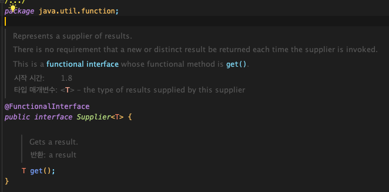

# 05. 자원을 직접 명시하지 말고 의존 객체 주입을 사용하라

## 1\. 개념

한 클래스 내에서 여러 개의 자원에 의존하여 사용되는 경우에 의존 객체 주입을 통해 유연성과 테스트 용이성을 개선하는 내용이다. 스프링의 의존성 주입 개념을 생각해 본다면 이미 당연하게 사용하고 있는 경우가 많을 것이지만, 의존 객체 주입의 장점을 다시 한번 생각해 볼 수 있는 내용이다.

[2023.11.06 - \[Spring\] - \[Spring\] IoC(제어의 역전) & DI(의존성 주입)의 개념](https://junhkang.tistory.com/42)

이펙티브 자바 책에서는 "맞춤법 검사기 (SpellChecker)" 클레스에서 "사전 (Dictionary)" 자원을 사용하는 예제를 들고 있다. 맞춤법 검사기 (SpellChecker)는 사전(dictionary) 자원에 의존하는 상황을 정적 유틸리티, 싱글턴, 의존객체 주입의 차이를 비교하고 있다.

## 2\. 예제

### 2-1. 정적 유틸리티

정적 유틸리티를 잘못 사용한 예 - 유연하지 않고 테스트하기 어렵다.

```
public class SpellCheckerStatic {
    private static final Lexicon dictionary = new Lexicon();

    private SpellCheckerStatic() {
    } // 객체 생성 방지

    public static boolean isValid(String word) {
        return dictionary.isValid(word);
    }

    public static List<String> suggestions(String typo) {
        return dictionary.suggestions(typo);
    }
}
```

### 2-2. 싱글턴

싱글턴을 잘못 사용한 예 - 유연하지 않고 테스트하기 어렵다. 

```
public class SpellCheckerSingleton {
    private static final Lexicon dictionary = new Lexicon();

    private SpellCheckerSingleton() {
    }
    public static SpellCheckerSingleton INSTANCE = new SpellCheckerSingleton();
    public static boolean isValid(String word) {
        return dictionary.isValid(word);
    }

    public static List<String> suggestions(String typo) {
        return dictionary.suggestions(typo);
    }
}
```

두방식 모두 dictionary 자원을 한 가지만 사용한다. 그렇기에 다양한 언어의 사전을 사용하거나 특수 언어용 사전을 별도로 쓰는 경우의 확장성을 생각해 보면 좋지 않다. 일반적으로 클래스에서 여러 자원을 참조할 경우 흔히 발생하는 상황이다. 위의 Spellchecker클래스에서 여러 사전을 유연하게 쓸 수 있도록 수정하려면 대표적으로 다음 두 가지 방식이 있을 것이다.

1. 단순히 dictionary 필드에서 final 제한을 제거하고 다른 사전으로 교체하는 메서드를 추가한다.

어색하고, 오류를 내기 쉬우며 멀티 스레드 환경에서 사용 불가능하다. 사용하는 자원 객체에 따라 이후 동작이 달라지는 클래스에서는 정적 유틸리티 클래스나 싱글턴 방식이 적합하지 않다.

2. 인스턴스를 생성하는 시점에 필요에 맞는 dictionary를 넘겨주는 방식으로 변경한다. (의존객체 주입)

의존 객체 주입의 한 형태로 맞춤법 검사기를 생성할 때 의존 객체인 사전을 주입해주면 된다. SpellChecker 클래스가 여러 인스턴스를 지원해야 하며 클라이언트가 원하는 자원을 사용해야 한다.

### 2-3. 의존객체 주입

의존객체 주입은 유연성과 테스트 용이성을 높여준다.

```
public class SpellCheckerInjection {
    private static final Lexicon dictionary;

    public SpellCheckerInjection(Lexicon disctionary) {
        this.dictionary = Objects.requireNonNull(disctionary);
    }
    public static boolean isValid(String word) {
        return dictionary.isValid(word);
    }
    public static List<String> suggestions(String typo) {
        return dictionary.suggestions(typo);
    }
}
```

예시에서는 dictionary라는 하나의 자원만 사용하지만 여러 개의 자원을 참조하는 경우가 대부분이다. 그런 상황에서 의존객체 주입을 사용했을 때의 장점을 생각해 보자.

-   몇 개의 자원에 의존하던 관계없이 실행된다.
-   불변성을 보장하여 여러 클라이언트가 의존객체들을 안심하고 공유할 수 있다.
-   테스트가 용이하다.

이에 변형으로 생성자에 자원 팩토리 자체를 넘겨주는 방식도 별도로 소개하고 있다. 호출될 때마다 특정 타입의 인스턴스를 반복해서 만들어주는 객체를 말한다.(팩토리 메서드 패턴) 책에서는 자바 8의 Supplier <T> 인터페이스를 팩토리를 표현한 완벽한 예제로 소개하고 있다.

<p align="center"></p>

팩토리의 타입 매개변수를 제한하며, 이 방식을 사용해 클라이언트는 자신이 명시한 타입의 하위 타입이라면 무엇이든 생성할 수 있는 팩토리를 넘길 수 있다. 다음 코드는 클라이언트가 제공한 팩토리가 생성한 타일들로 구성된 Mosaic를 만드는 샘플 메서드이다.

```
Mosaic create(Supplier<> extends Tile> tileFactory) {
    Tile tile = tileFactory.get();
    return new Mosaic(tile);
}
```

## 3\. 정리

클래스가 내부에서 하나 이상의 자원에 의존할 때 클래스 동작에 영향을 주는 자원이 있다면 싱글턴, 정적 유틸 클래스는 사용하지 않는 것이 좋고 이 자원들을 클래스가 새로 생성해서도 안된다. 필요한 자원들을 생성자에 넘겨주는 생성자 주입 방식으로 구현하면 클래스의 유연성, 재사용성, 테스트 용이성을 매우 개선해 준다.

블로그 : https://junhkang.tistory.com/76