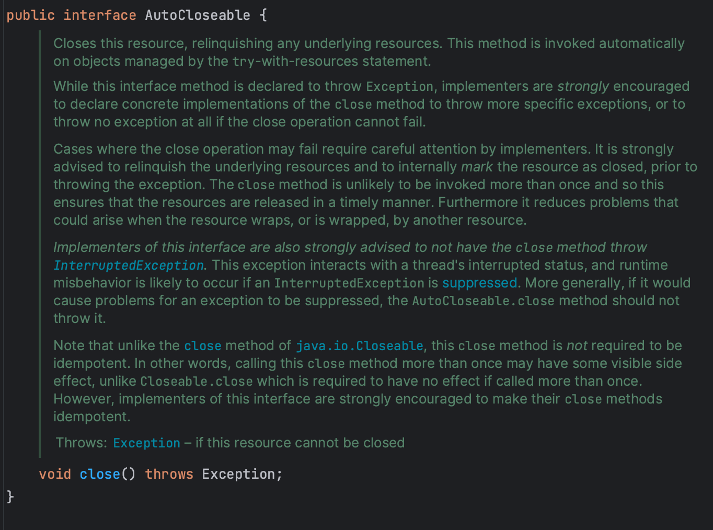

## 1\. 개념

자바 라이브러리에는 close 메서드를 직접 호출해서 닫아줘야 하는 자원이 많다. 대표적으로 InputStream, ouputStream java.sql.connection 등이 있으며 해당 자원들은 클라이언트에서 놓치기 쉬워 예측할 수 없는 성능 문제로 이어지곤 한다. 이중 상당 수가 finalizer를 안정망으로 사용하여 문제에 대비하고 있긴 하지만, 완전히 안전하다고 할 수 없다. (해당 내용은 다음 포스트에서 확인 가능)

[08. finalizer 와 cleaner 사용을 피하라](https://github.com/junhkang/effective-java-summary/blob/master/src/main/java/org/example/ch01/item08/concept.md)

흔히 사용하는 try-finally를 사용한 예외처리를 확인해보자

## 2\. try-finally

### 2-1. 자원을 1개 사용하는 try-finally 메서드

```
static String firstLineOfFile(String path) throws IOException    {
       BufferdReader br = new BufferedReader(new FileReader(Path));
       try {
           return br.readLine();
       }    finally {
           br.close();
       }
   }
```

### 2-2. 자원을 2개 사용하는 try-finally 메서드

자원을 1개 사용하는 경우는 꽤나 괜찮아 보인다, 그렇다면 자원을 여러 개 쓰는 경우 어떻게 될까?

```
static void copy(String src, String dst) throws IOException  {
        InputStream in = new FileInputStream(src);
        try {
            OutputStream out = new FileOutputStream(dst);
            try {
                byte[] buf = new byte[BUFFER_SIZE];
                int n;
                while ((n = in.read(buf)) >= 0)
                    out.write(buf, 0, n);
            }   finally {
                out.close();
            }
        } finally {
            in.close();
        }
   }
```

예제에서 볼 수 있듯, 2개 이상의 자원을 **try-finally**로 구현하면 너무 지저분해진다. 두 메서드 모두 올바르게 **try-finally**를 사용했지만 미묘한 결점이 있다. 바로 특정 예외가 숨겨질 수 있다는 점이다.

### 2-3. try-finally의 결점

해당 메서드들은 try, finally 구문에서 모두 예외가 발생할 수 있다. 기기에 물리적 문제가 생기면 firstLineOfFile 메서드 안에 readLine 메서드가 예외를 던질 것이고, 그 이후 close 메서드도 실패하게 된다. 이 경우 두 번째 예외(close)가 첫 번째 예외(readLine)를 집어삼킨다. 그러면 stack traces에 첫 번째 예외는 정보가 남지않아서 실제 시스템에서 디버깅을 어렵게한다. 실제 운영 상황에서 문제를 해결하기 위해서는 첫번째 예외에 대한 로그를 보고 싶은 경우가 분명 있을 것이고,  두 번째 예외 대신 첫 번째 예외를 찍도록 코드를 수정할 수는 있지만, 코드가 너무 지저분해져서 그렇게 사용하는 경우는 거의 없다.

## 3\. try-with-resources

이런 문제는 자바 7에서 **try-with-resources**로 모두 해결된다. 이 구조를 사용하면 해당 자원이 AutoCloseable인터페이스를 구현해야 한다. AutoCloseable 인터페이스를 확인해 보면 다음과 같이 close() 메서드만으로 이루어진 인터페이스이다.

<p align="center"></p>

구현된 AutoClosebale (정의된 close 메서드는) 리소스를 닫을 때 호출되며 명시적으로 닫아줄 필요 없이 자동으로 자원을 닫히게 해 준다.

```
try (ResourceType resource = acquireResource()) {
    // 리소스를 사용하는 코드
}
```

예를 들어 해당 코드에서 ResourceType은 AutoCloseable을 구현한 클래스이고, try 블록이 끝나면 자동으로 close() 메서드가 호출되며 리소스가 안전하게 닫힌다. 예외가 발생하더라도 리소스가 정확히 닫힘을 보장할 수 있다. 다양한 서드파티 라이브러리들도 AutoCloseable 인터페이스를 구현/확장하고 있어서 이 기능을 사용할 수 있다. 효율적인 자원 관리를 위해 닫아야 하는 자원을 대상으로 한다면 AutoCloseable을 꼭 구현해야 한다. 이제 위의 2개 메서드에 각각 try-with-resource를 적용해 보자

### 3-1. 자원을 1개 사용하는 try-with-resource 메서드

```
static String firstLineOfFile(String path) throws IOException {
    try (BufferedReader br = new BufferedReader(
            new FileReader(path))) {
        return br.readLine();
    }
}
```

### 3-2. 자원을 2개 사용하는 try-with-resource 메서드

```
static void copy(String src, String dst) throws IOException  {
     try (InputStream in = new FileInputStream(src);
          OutputStream out = new FileOutputStream(dst))  {
         byte[] buf = new byte[BUFFER_SIZE];
         int n ;
         while ((n = in.read(buf)) >= 0)
             out.write(buf, 0, n);
     }
}
```

한눈에 봐도 가독성이 더 좋으며, 문제를 진단하기도 좋다. firstLineOfFiles 메서드를 먼저 확인해 보면, readLine, close에서 둘 다 에러가 발생할 시 기존의 **try-finally** 메서드와 다르게 숨겨진 예외(readLine)들도 버려지지 않고 stack trace에 숨겨졌다는(suppressed) 꼬리표를 달고 출력된다. 또한 자바 7의 Throwable에 추가된 getSuppressed 메서드를 사용하면 코드상에서도 쓸 수 있다.

### 3-3. try-with-resource와 catch 메서드

보통 **try-finally**처럼 **try-with-resources**에서도 catch절을 쓸 수 있다. catch을 함께 사용하면 try 문을 더 중첩하지 않고 다수의 예외처리가 가능하다. firstLineOfFile 메서드를 수정하여 예외가 발생했을 때 예외를 던 지는 대신 기본값을 반환하도록 수정하면 다음과 같다.

```
static String firstLineOfFile(String path, String defaultVal) {
        try (BufferedReader br = new BufferedReader(
                new FileReader(path))) {
            return br.readLine();
        } catch (IOException e) {
            return defaultVal;
        }
    }
```

## 4\. 정리

꼭 회수해야 하는 자원을 다룰 때는 **try-finally** 가 아닌, **try-with-resources**를 사용하자. 예외적인 경우는 없으며 코드는 간결하고 분명해지고 예외정보를 추적하기에도 훨씬 좋다.

블로그 : https://junhkang.tistory.com/81